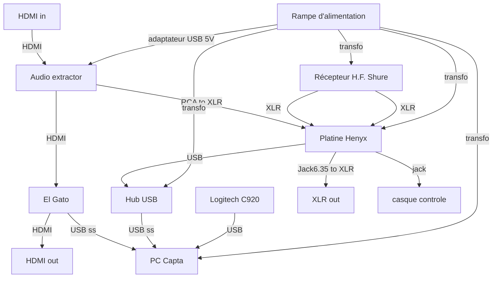

# captationConfig

```mermaid
graph TD;
    A[HDMI in]-- HDMI -->B[Audio extractor];
    B[Audio extractor]-- HDMI -->C[El Gato];
    C[El Gato]-- HDMI -->D[HDMI out];
    B[Audio extractor]-- RCA to XLR --> G[Platine Henyx]
    C[El Gato]-- USB ss-->E[PC Capta];
    H[Récepteur H.F. Shure]-- XLR -->G[Platine Henyx];
    H[Récepteur H.F. Shure]-- XLR -->G[Platine Henyx];
    G[Platine Henyx]-- USB -->F[Hub USB];
    F[Hub USB]-- USB ss-->E[PC Capta];
    L[Logitech C920]-- USB -->E[PC Capta];
    G[Platine Henyx]-- Jack6.35 to XLR -->I[XLR out];
    G[Platine Henyx]-- jack -->J[casque controle];
    K[Rampe d'alimentation]-- transfo -->H[Récepteur H.F. Shure];
    K[Rampe d'alimentation]-- transfo -->F[Hub USB];
    K[Rampe d'alimentation]-- transfo -->E[PC Capta];
    K[Rampe d'alimentation]-- transfo -->G[Platine Henyx];
    K[Rampe d'alimentation]-- adaptateur USB 5V -->B[Audio extractor];    
```
