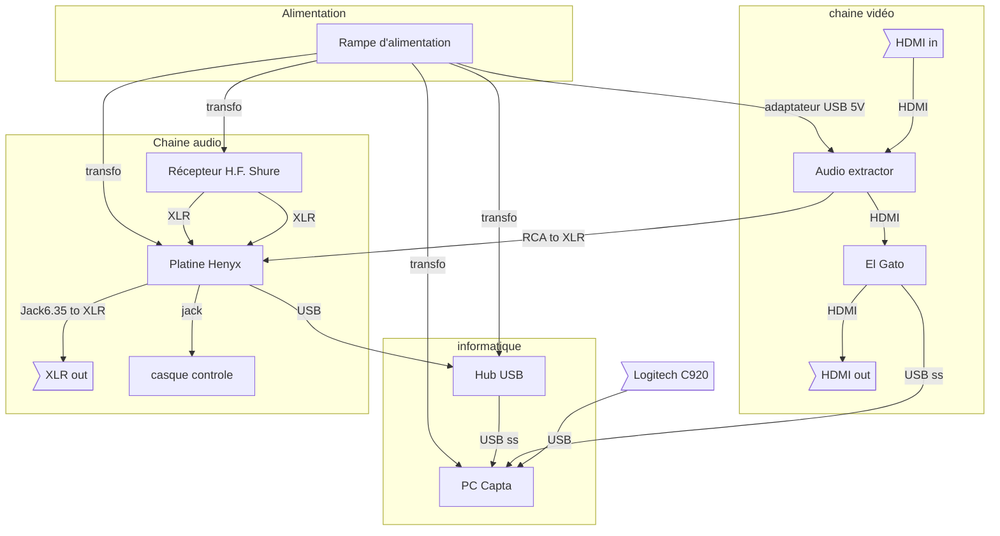

# captationConfig

```mermaid
graph TD;

subgraph chaine vidéo
    direction LR
    A>HDMI in]-- HDMI -->B[Audio extractor]-- HDMI -->C[El Gato]-- HDMI -->D>HDMI out];
end

    L>Logitech C920]-- USB -->E[PC Capta];

subgraph informatique
    C[El Gato]-- USB ss-->E[PC Capta];
    F[Hub USB]-- USB ss-->E[PC Capta];
end

subgraph Chaine audio
    direction LR
    B[Audio extractor]-- RCA to XLR --> G[Platine Henyx];
    H[Récepteur H.F. Shure]-- XLR -->G[Platine Henyx];
    H[Récepteur H.F. Shure]-- XLR -->G[Platine Henyx];
    G[Platine Henyx]-- USB -->F[Hub USB];
    G[Platine Henyx]-- Jack6.35 to XLR -->I>XLR out];
    G[Platine Henyx]-- jack -->J[casque controle];
end

subgraph Alimentation
    K[Rampe d'alimentation]-- transfo -->H[Récepteur H.F. Shure];
    K[Rampe d'alimentation]-- transfo -->F[Hub USB];
    K[Rampe d'alimentation]-- transfo -->E[PC Capta];
    K[Rampe d'alimentation]-- transfo -->G[Platine Henyx];
    K[Rampe d'alimentation]-- adaptateur USB 5V -->B[Audio extractor];    
end

```
